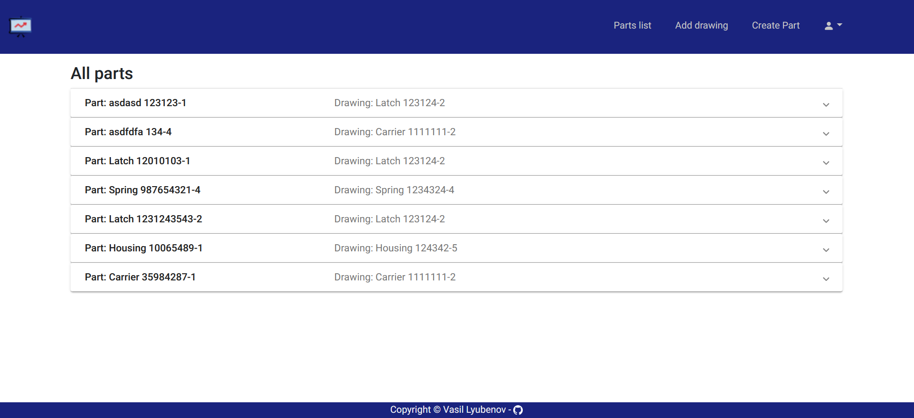
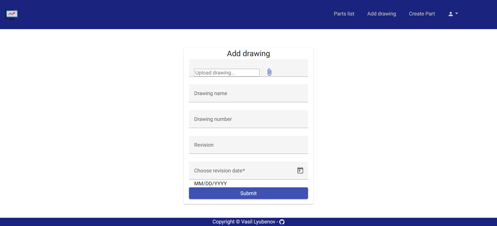
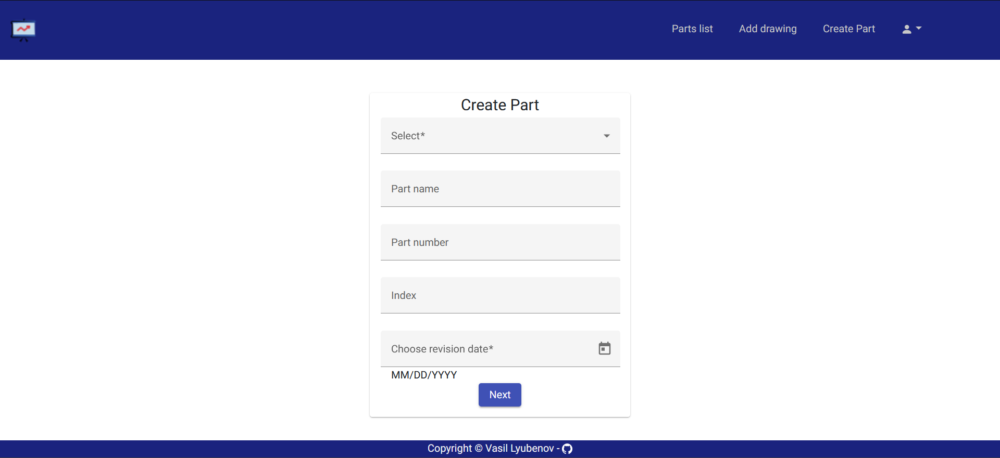
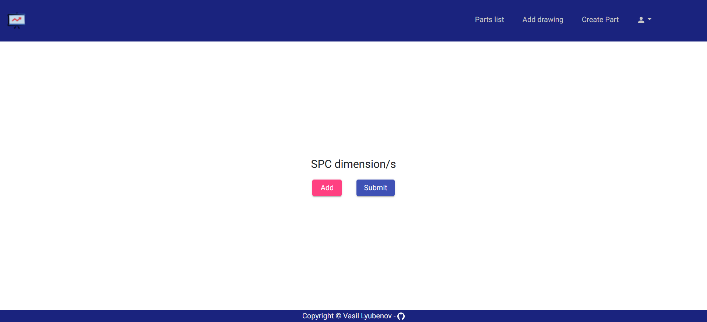
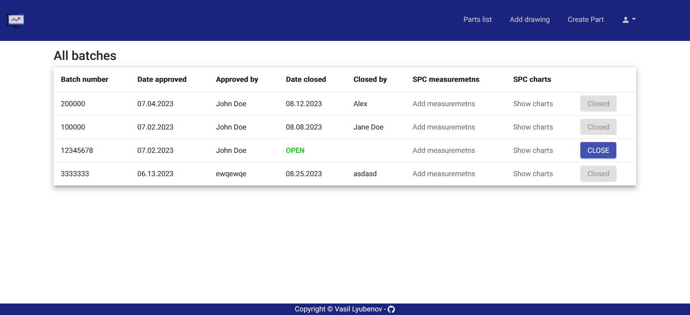
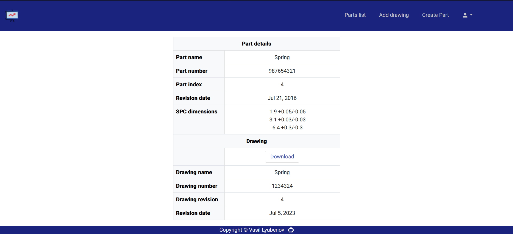
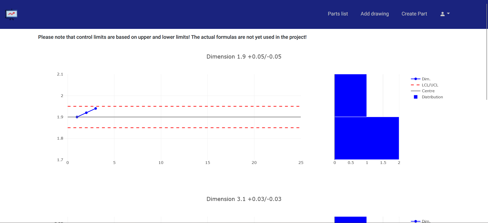

# SPC Playground

This app was created for SoftUni's project defence after the course about Angular. The project aim is solely for training purposes on a topic that I find interesting to implement. The main idea of the project is to show Statistical Process Control charts based on measurement results from manufactured products.

## Live demo

https://spc-playground-e9f71.web.app

## Technologies
The project is created with:
* [Angular CLI](https://github.com/angular/angular-cli) version 16.1.4
* [Angular material](https://github.com/angular/components) version 16.1.4
* [Bootstrap](https://github.com/twbs) version 5.2.3
* [Angular plotly](https://github.com/plotly/angular-plotly.js) version 5.2.1
* BaaS - [Supabase](https://github.com/supabase/supabase)
* Hosting - Firebase

## Installation

#### Install dependencies

```bash
  npm i
```

#### Navigate to project folder

```bash
  cd spc-playground
```

#### Start the project

```bash
  ng s
```

Navigate in browser to `http://localhost:4200/`. The application will automatically reload if you change any of the source files.
    
# Screenshots







